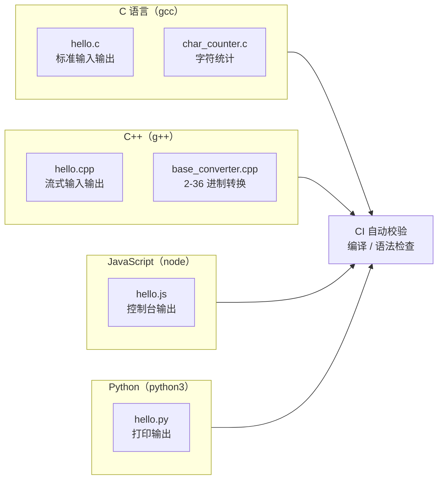

# programming-exercises

<p align="center">
  
  
  
  
  
  
</p>

面向初学者的多语言编程练习仓库。每个目录是一类语言的入门示例，覆盖最基础的输入输出、控制流、字符处理与算法小练习。

## 示例总览



## 目录结构

```
c/        C 语言示例（gcc 编译）
  hello.c            入门：标准输入输出，打印 "Hello, C!"
  char_counter.c     字符统计：从标准输入读取一行，统计大写字母、小写字母、
                     空格、数字与其他字符的个数
cpp/      C++ 示例（g++ 编译）
  hello.cpp          入门：流式输入输出，打印 "Hello, C++!"
  base_converter.cpp 任意进制转换器：支持 2-36 进制互转、大小写不敏感输入，
                     并输出运行耗时与时间复杂度分析
js/       JavaScript 示例（node 运行）
  hello.js           入门：控制台输出 "Hello, JavaScript!"
python/   Python 示例（python3 运行）
  hello.py           入门：打印 "Hello, project!"
```

## 如何运行

### C

```bash
gcc c/hello.c -o hello
./hello

gcc c/char_counter.c -o char_counter
echo "Hello 123" | ./char_counter
# 输出：1 4 1 3 0 （大写 小写 空格 数字 其他）
```

### C++

```bash
g++ cpp/hello.cpp -o hello
./hello

g++ cpp/base_converter.cpp -o base_converter
./base_converter
# 按提示输入数字、源进制、目标进制，例如：FF / 16 / 10
```

### JavaScript

```bash
node js/hello.js
```

### Python

```bash
python3 python/hello.py
```

> Windows 用户请将编译产物命名为 `.exe`（如 `gcc c/hello.c -o hello.exe`），运行 `.\hello.exe`。

## 校验

仓库通过 GitHub Actions 自动检查：C/C++ 示例使用 `gcc`/`g++` 编译、JS 使用 `node --check`、Python 使用 `python3 -m py_compile`，确保每个示例文件至少能通过编译/语法检查。

## 许可证

本项目基于 [MIT License](LICENSE) 开源。
