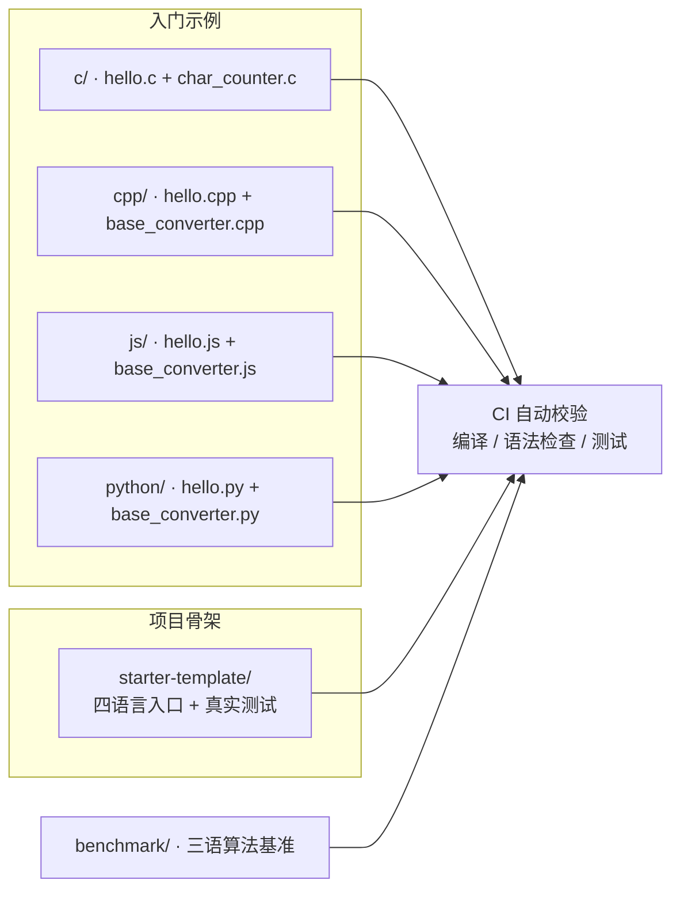
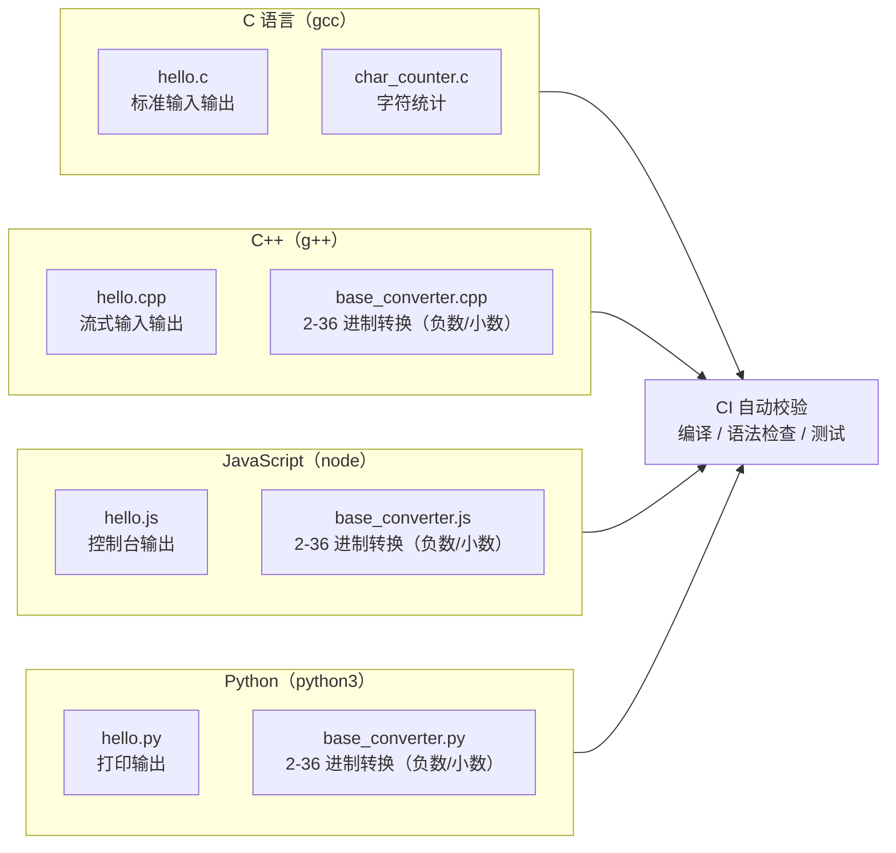

# programming-exercises

<p align="center">
  
  
  
  
  
  
  
</p>

面向初学者的多语言编程练习仓库。每个目录是一类语言的入门示例，覆盖最基础的输入输出、控制流、字符处理与算法小练习。

本仓库于 2026-08-22 合并了三个仓库：
- **programming-exercises**（原仓库）
- **code-practice** → 并入 [`starter-template/`](starter-template/)（多语言项目骨架 + 真实测试）
- **base-conversion** 的进制转换 → 并入 `python/base_converter.py`、`js/base_converter.js`、`cpp/base_converter.cpp`（三语一致，支持负数与小数）

## 仓库总览



## 进制转换器（三语一致 · 支持负数与小数）

三份实现共用同一套函数与语义：任意进制互转（2-36）、负数、小数（最多 15 位）、`--test` 内置测试，并在 CI 中自动执行。

| 语言 | 文件 | 精度策略 |
| --- | --- | --- |
| Python | [`python/base_converter.py`](python/base_converter.py) | `int` 任意精度整数 + `Fraction` 精确小数 |
| JavaScript | [`js/base_converter.js`](js/base_converter.js) | `BigInt` 整数（避免 2^53 丢失）+ 有理数小数 |
| C++ | [`cpp/base_converter.cpp`](cpp/base_converter.cpp) | `long long` 整数 + `double` 小数（教学示例） |

```bash
# 三语用法一致
python3 python/base_converter.py 255 10 16     # -> FF
node    js/base_converter.js -123 10 2          # -> -1111011
./cpp/base_converter 10.5 10 16                 # -> A.8（先编译）

# 内置测试（15+15+15 = 45 个断言）
python3 python/base_converter.py --test
node    js/base_converter.js --test
./cpp/base_converter --test
```

## 算法基准测试（benchmark/）

三语一致的算法耗时实测（线性查找 / 二分查找 / 冒泡排序），同时包含进制转换断言与内置测试，并在 CI 中自动执行。下表为 2026-08-21 本机实测数据（MSVC /O2、Python 3.14、Node.js 24）：

| 算法 | C++ | Python 3.14 | Node.js 24 |
| --- | --- | --- | --- |
| 线性查找 O(n)，n = 10 000 | ≈0 ms* | 0.2112 ms | 0.0897 ms |
| 二分查找 O(log n)，n = 10 000 | ≈0 ms* | 0.0030 ms | 0.0073 ms |
| 冒泡排序 O(n²)，n = 1 000 | 0.4 ms | 19.30 ms | 5.14 ms |

\* C++ 线性/二分查找耗时低于 0.5 ms 计时精度。


```bash
g++ -O2 -std=c++11 -Wall -Wextra benchmark/benchmark.cpp -o benchmark && ./benchmark
python3 benchmark/benchmark.py --test
node    benchmark/benchmark.js
```

## 示例总览



## 如何运行

### C

```bash
gcc c/hello.c -o hello
./hello

gcc c/char_counter.c -o char_counter
echo "Hello 123" | ./char_counter
# 输出：1 4 1 3 0 （大写 小写 空格 数字 其他）
```

### C++

```bash
g++ cpp/hello.cpp -o hello
./hello

g++ cpp/base_converter.cpp -o base_converter
./base_converter
# 交互：输入数字、源进制、目标进制，例如：FF / 16 / 10
# 命令行：./base_converter FF 16 10
```

### JavaScript

```bash
node js/hello.js
node js/base_converter.js FF 16 10
```

### Python

```bash
python3 python/hello.py
python3 python/base_converter.py FF 16 10
```

### 项目骨架（starter-template）

```bash
cd starter-template
python src/main.py                 # 或 node src/index.js / gcc src/main.c ...
python -m unittest discover -s tests -v   # 运行真实测试
```

> Windows 用户请将编译产物命名为 `.exe`（如 `gcc c/hello.c -o hello.exe`），运行 `.\hello.exe`。

## 校验

仓库通过 GitHub Actions 自动检查：

- C/C++ 示例使用 `gcc`/`g++` 编译（含 `-Wall -Wextra`）
- JS 使用 `node --check` 语法检查
- Python 使用 `python3 -m py_compile`
- 三语进制转换器各运行 `--test`（45 个断言）
- `starter-template` 运行 `python -m unittest`（3 个真实断言）
- `benchmark/` 三语算法基准各运行测试（54 个断言）

## 历史仓库

- [`code-practice`](https://github.com/xiaomaozjj666/code-practice)：已归档；内容并入 [`starter-template/`](starter-template/)
- [`base-conversion`](https://github.com/xiaomaozjj666/base-conversion)：已归档；进制转换并入 `python|js|cpp/base_converter.*`，benchmark 并入 [`benchmark/`](benchmark/)（2026-08-29 迁移）

## 许可证

本项目基于 [MIT License](LICENSE) 开源。
